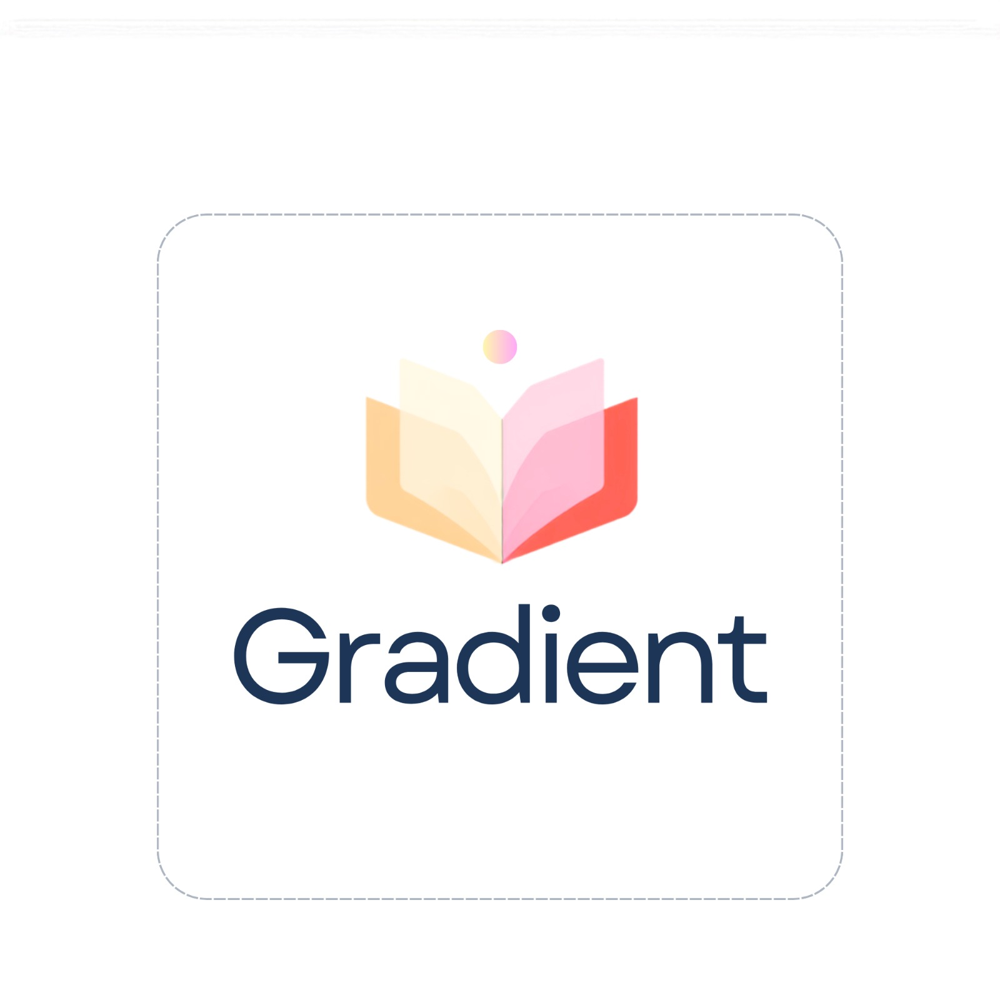

# Gradient (v1.0) 🎓✨
> **Personalized AI Learning & Focus Assistant for SPPU Engineering (2024 Revised Pattern)**

[](https://flutter.dev)
[](https://github.com/Paincar/Gradient-Study-App/releases)
[](https://unipune.ac.in)
[](LICENSE)

<p align="center">
  
</p>

---

## 🌟 Overview
**Gradient** is a purpose-built, distraction-free native Flutter application designed specifically for **Savitribai Phule Pune University (SPPU) First Year Engineering (FE)** students. Traditional education provides standard one-size-fits-all material, but students learn at different speeds with distinct pain points. Gradient removes these bottlenecks with an adaptive AI tutor, intelligent PYQ quiz engine, deep timetable scheduling, and a system-level focus shield.

---

## 🚀 Key Features in Version 1.0

### 🧠 1. Dynamic AI PYQ Quiz Generator
- **Previous Year Question (PYQ) Targeting:** Quizzes are generated dynamically on-the-fly using SPPU exam patterns, weightage, and high-frequency topics.
- **Dual AI Mode:**
  - **Google Gemini API:** Native Gemini 2.0 / 2.5 Flash for detailed explanations and conceptual step-by-step breakdowns.
  - **Local OpenAI-Compatible API:** Full support for self-hosted local LLMs (e.g. `llama.cpp`, Ollama, vLLM) for offline/local AI learning.
- **Mastery Tracking:** Continuously tracks unit-by-unit confidence and automatically adapts timetable priority for challenging topics.

### 🛡️ 2. Deep Focus Sanctuary & App Blocking
- **System-Level Focus Shield:** Monitors distracting apps (Instagram, YouTube, etc.) during study sessions and displays native warning notifications if thresholds are exceeded.
- **Curated Ambient Soundscapes:** Built-in relaxing audio (Rain, Stream, White Noise, Fireplace, Coffee Shop, Library) and integrated Spotify study soundtrack player.

### 📅 3. Smart Timetable & Absolute Scheduling Engine
- **SPPU Curriculum Aligned:** Built-in schedule templates covering all Semester 1 & 2 engineering subjects.
- **Zero Timezone Drift:** Absolute local calendar and notification scheduling ensuring precision down to the minute.
- **Google Calendar Export:** One-tap export of weekly study blocks and revision slots directly to your personal calendar.

### 📊 4. Real-Time Analytics & Streak Tracking
- **Zero Dummy Data:** Completely authentic, persistent local study analytics tracking daily, weekly, and subject-wise focus hours.
- **WhatsApp Streak Share:** Share your live study streaks with friends on WhatsApp directly from the dashboard badge.

### 📝 5. Academic Notes & Cloud Sync
- **Rich Markdown Notes:** Tagged by subject, unit, and exam importance.
- **Firebase Authentication & Cloud Sync:** Seamless Google Sign-In with automated bidirectional Firestore synchronization.

### 🎨 6. Elegant Rosé Pine & Theming
- Fully customized Rosé Pine palette with Dark / Dawn (Light) themes, Catppuccin accents, smooth animated transitions, and accessibility-first responsive design.

---

## 🛠️ Tech Stack
- **Framework:** Flutter / Dart (Null-Safe)
- **State Management:** Riverpod 2.x
- **AI Engines:** Google Generative AI (Gemini Flash) & OpenAI-compatible REST API
- **Cloud & Auth:** Firebase Core, Firebase Auth (Google Sign-In), Cloud Firestore
- **Local Storage:** SharedPreferences & Native Secure Storage
- **Charts & Audio:** `fl_chart`, `just_audio`

---

## 📱 Getting Started

### Prerequisites
- Flutter SDK `>=3.0.0`
- Android Studio / VS Code
- Android device or emulator running Android 8.0+ (API 26+)

### Installation
```bash
# Clone the repository
git clone https://github.com/Paincar/Gradient-Study-App.git
cd Gradient-Study-App

# Fetch dependencies
flutter pub get

# Run on your connected device
flutter run
```

---

## 📄 License
This project is licensed under the MIT License.
